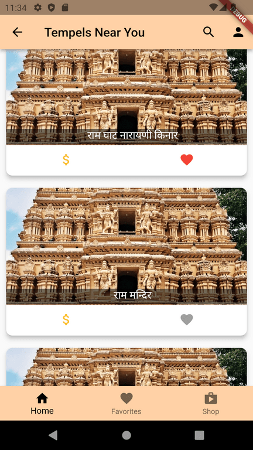

# Temple

A find me near by hindu temples project.

## Getting Started

For more information about me please visit https://nibeshkhadka.com

### Errors I've encountered 

1. **API keys with referer restrictions cannot be used with this API.** Changing the api referrer from http to server helped.
2. ****

## Home Page

Homepage of this app looks like this:

Here the page starts with the daily quote from hindu holy books like gita. After that is grid view of Custom Card Buttons, whose purpose is to send user to relevant subpages on click.

## Temples List
Usually you should create a marketing teams to promote assoiciations to add their temples in our app. BUt for the sake of app, I am using google Places API for find nearby temples upto 20 in numbers. Then storing those temples in firestore. Also, places API doesn't provide images, it is provided by places details api which I am not using. Hence, a random Image URL from the firebase storage is pulled to be saved as image for those temples. The subpage temple-list-screen looks as follows. 

